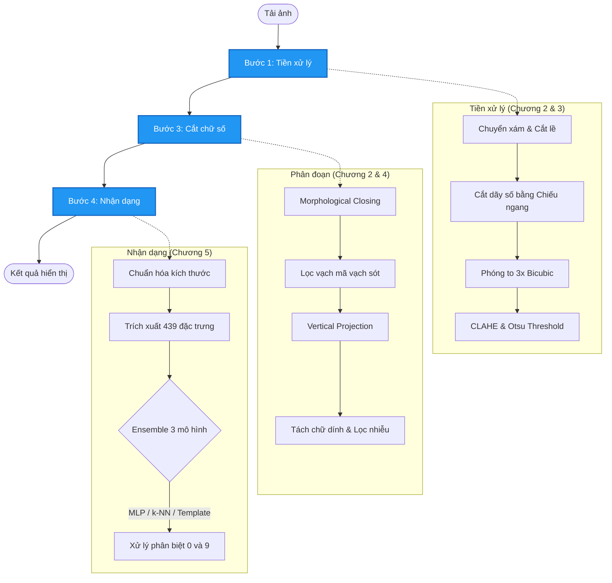
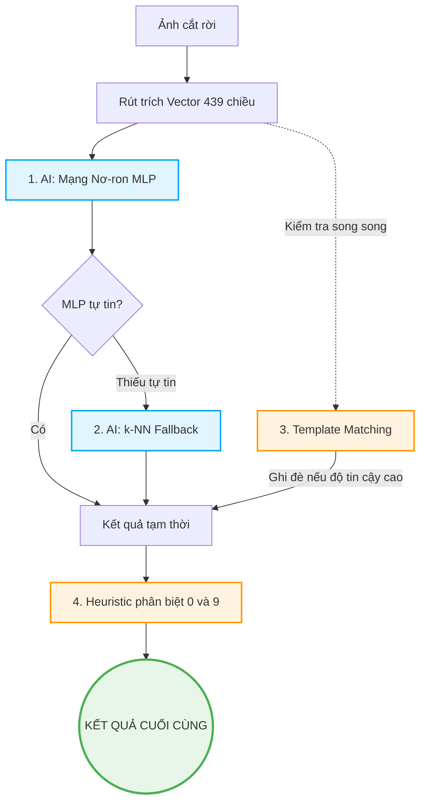

# xu-ly-anh
# Hệ thống Nhận dạng Số dưới Mã vạch Vận chuyển (SPX/J&T)

Dự án này xây dựng một pipeline **Computer Vision + Machine Learning** hoàn chỉnh, chạy hoàn toàn **local**, để nhận dạng dãy số nằm bên dưới mã vạch trên phiếu vận chuyển (SPX, J&T, v.v.) từ ảnh chụp điện thoại.

> Không dùng OCR cloud, không phụ thuộc API ngoài. Toàn bộ xử lý diễn ra trên máy, phù hợp với bài tập môn Xử lý Ảnh.

---

## 1. Mục tiêu bài toán

Trên các phiếu vận chuyển (SPX, J&T, ...), luôn có một **mã vạch** (barcode) và ngay bên dưới là **dãy số** tương ứng được in ra. Mục tiêu của hệ thống là **đọc tự động dãy số đó** từ một ảnh chụp bằng điện thoại, mà không cần kết nối mạng hay dùng dịch vụ OCR bên ngoài.

### 📥 Input — Ảnh đầu vào

- **Định dạng chấp nhận:** JPG, JPEG, PNG, BMP
- **Nguồn gốc:** Ảnh chụp trực tiếp từ điện thoại hoặc scan
- **Điều kiện thực tế được xử lý:**

| Tình huống | Ví dụ |
|---|---|
| Ảnh bình thường | Chụp thẳng, đủ sáng, rõ nét |
| Thiếu sáng nhẹ | Chụp trong điều kiện ánh sáng yếu |
| Nhiễu nhẹ | Ảnh JPEG bị nén, có hạt nhiễu nhỏ |
| Nghiêng nhẹ | Mã vạch không hoàn toàn nằm ngang |
| Mực nhòe nhẹ | Máy in nhiệt bị lem mực |

> ⚠️ Hệ thống **chưa xử lý tốt** với ảnh bị mờ nặng (rung tay mạnh), che khuất một phần dãy số, hoặc chụp quá nghiêng (> ~15°).

### 📤 Output — Kết quả đầu ra

Sau khi xử lý, hệ thống trả về:

- **Chuỗi số nhận dạng** — hiển thị trực tiếp trên giao diện, ví dụ:
  ```
  8163456789013
  ```
- **Ảnh các chữ số đã cắt rời** — hiển thị từng ký tự để người dùng kiểm tra trực quan
- **Thông tin phương pháp** — ghi chú kỹ thuật đã dùng ở từng bước

> Không có file JSON hay ảnh debug lưu ra đĩa — toàn bộ kết quả được hiển thị **trực tiếp trên giao diện** trong cùng một phiên làm việc.

---

## 2. Cấu trúc thư mục thực tế

```
xu-ly-anh/
├── main.py                    # Ứng dụng GUI chính (Tkinter)
├── preprocessing.py           # Module tiền xử lý ảnh (Chương 2 & 3)
├── segmentation.py            # Module phân đoạn chữ số (Chương 2 & 4)
├── recognition.py             # Module trích đặc trưng + nhận dạng (Chương 5)
├── visualize_ch5.py           # Script trực quan hóa đặc trưng Chương 5
├── requirements.txt
└── data/
    ├── collect_samples.py     # Công cụ GUI thu thập mẫu dữ liệu
    └── digit_templates/       # Ảnh mẫu chữ số thật đã thu thập (~178 file)
        ├── digit_0_<timestamp>_<idx>.png
        ├── digit_1_...png
        └── ...
```

---

## 3. Luồng xử lý (Pipeline) từng bước

Ứng dụng chính (`main.py`) chia quy trình thành **4 bước rõ ràng**, người dùng chủ động bấm nút từng bước:



---

### Bước 1 – Tiền xử lý ảnh (`preprocessing.py`)

**Chương 2 + Chương 3 được áp dụng tại đây.**

| STT | Kỹ thuật | Chi tiết |
|---|---|---|
| 1 | Chuyển xám | `cv2.cvtColor(BGR → GRAY)` |
| 2 | Ngưỡng nhị phân đơn giản | Threshold 200 + `THRESH_BINARY_INV` để tìm vùng nội dung |
| 3 | Crop lề thừa | `findNonZero` + `boundingRect` để loại bỏ viền trắng xung quanh |
| 4 | **Chiếu ngang (Horizontal Projection)** | Tính tổng pixel theo từng hàng (`np.sum(axis=1)`), tìm hàng có ít mực nhất trong vùng 50–95% chiều cao để xác định ranh giới mã vạch và dãy số |
| 5 | **Biến đổi hình học (Chương 3)** | Phóng to ROI số lên **3× (Bicubic interpolation)** — `cv2.resize(..., interpolation=INTER_CUBIC)` |
| 6 | **Cân bằng tương phản** | `CLAHE` (`clipLimit=0.95`, `tileGridSize=(8,8)`) |
| 7 | **Nhị phân hóa Otsu** | `THRESH_BINARY_INV + THRESH_OTSU` — tự động chọn ngưỡng tốt nhất |

**Đầu ra:** Ảnh nhị phân (chữ trắng, nền đen) chứa dãy số đã được phóng to và làm sạch.

---

### Bước 3 – Phân đoạn chữ số (`segmentation.py`)

**Áp dụng kiến thức Chương 2 và Chương 4:**
- **Chương 2 (Hình thái học - Morphology):** Được sử dụng ở bước **3a** (Morphological Closing) để nối nét đứt gãy, và bước **3e** (Erosion trong `split_by_morph_fallback`) để hỗ trợ tách các chữ số bị dính liền.
- **Chương 4 (Phân đoạn ảnh - Image Segmentation):** Được sử dụng ở bước **3d** và **3e** thông qua kỹ thuật **Vertical Projection** (chiếu dọc) để tìm các khoảng trống (gap/valley) nhằm cắt rời từng chữ số.

Pipeline gồm nhiều pass liên tiếp:

#### 3a. Morphological Closing (Ứng dụng Chương 2)
- Kernel `2×2` để nối các nét đứt gãy nhỏ bên trong chữ số mà không làm dính 2 chữ liền nhau.

#### 3b. Lọc nhiễu vạch mã vạch còn sót (`remove_barcode_bar_artifacts`)
- Dùng **Connected Components** (`connectedComponentsWithStats`) để tìm các blob.
- Loại bỏ blob có `aspect_ratio ≥ 5.5` (rất cao so với rộng) AND bám vào 10% phía trên ảnh — đây là đặc trưng của vạch barcode sót.

#### 3c. Xác định dải chữ số chính (`keep_main_digit_band`)
- Tính **Horizontal Projection** → tìm các "band" liên tục có mực.
- Chọn band có score cao nhất (kết hợp lượng mực + độ dày + thiên về vùng thấp) để giữ lại dãy số, bỏ đốm/vệt ở phía trên.

#### 3d. Vertical Projection – PASS 1 (Ứng dụng Chương 4)
- Tính tổng pixel theo từng cột (`np.sum(axis=0)`).
- Ngưỡng gap = 3.5% của cột có mực nhiều nhất.
- Xác định các **segment** (đoạn có chữ).
- Lọc segment quá mảnh (< 20% độ rộng trung bình).

#### 3e. Tách chữ số dính – PASS 2 (Ứng dụng kết hợp Chương 4 và Chương 2)
- Với mỗi segment nghi là 2 chữ dính (rộng hơn 1.35× trung bình AND không có lỗ bên trong):
  - **Thử 1 (Chương 4):** `split_one_segment` — áp dụng lại Vertical Projection nội bộ, tìm valley nhỏ nhất trong vùng 20–80% chiều rộng, chỉ cắt nếu valley < 30% max.
  - **Thử 2 Fallback (Chương 2):** `split_by_morph_fallback` — erode nhẹ `(1×2)` rồi dùng Connected Components, chỉ chấp nhận nếu tách ra đúng 2 phần hợp lệ.
- Ký tự có lỗ (0, 6, 8, 9) được phát hiện bởi `has_inner_hole` (dùng `RETR_CCOMP`) → **ưu tiên giữ nguyên**, tránh tách nhầm.

#### 3f. Lọc bbox nhiễu
- Lọc box quá hẹp, `fill_ratio > 70%` (vạch dọc), và **"flat vertical stroke"** — profile mực theo hàng quá đều (CV < 0.22) với fill cao → chính là vạch barcode.

#### 3g. Pass hoàn thiện (`refine_wide_boxes_iterative`)
- Lặp tối đa 3 vòng để tách tiếp các box còn rộng hơn 1.42× trung bình (tiếp tục sử dụng lại logic của bước 3e).

**Đầu ra:** Danh sách ảnh chữ số riêng lẻ đã crop (thêm padding 2px).

---

### Bước 4 – Nhận dạng chữ số (`recognition.py`)

**Sự kết hợp giữa lý thuyết Chương 5 và Trí tuệ nhân tạo (AI - Machine Learning) được áp dụng tại đây.** 
Luồng hoạt động của mô hình được thiết kế theo chuẩn một quy trình Machine Learning hoàn chỉnh: từ chuẩn bị dữ liệu, trích xuất đặc trưng (Chương 5), huấn luyện, cho đến kết hợp mô hình (Ensemble) để dự đoán.

#### Luồng hoạt động tạo và huấn luyện mô hình (Training Workflow)
1. **Thu thập và Sinh mẫu (Synthetic Data):** Nếu bộ template thật không đủ 10 lớp chữ số, hệ thống tự động sinh ảnh chữ số nhân tạo bằng font `FONT_HERSHEY_SIMPLEX` (`scale=1.6`, `thickness=3`) để đảm bảo tính cân bằng dữ liệu.
2. **Chuẩn hóa ảnh đầu vào:** Mỗi ảnh mẫu được resize về đúng `50×50` (giữ nguyên tỷ lệ) và căn giữa trên nền đen/trắng tiêu chuẩn để khử nhiễu kích thước và vị trí.
3. **Data Augmentation (Tăng cường dữ liệu):** Từ một mẫu ban đầu, hệ thống nhân bản thành **7 biến thể** (dịch trái/phải/trên/dưới ±1px, dilate, erode). Việc này giúp AI tổng quát hóa tốt hơn, tránh học vẹt (overfitting).
4. **Trích xuất đặc trưng (Feature Extraction - Áp dụng Chương 5):** Biến đổi ảnh ma trận pixel thô thành các vector đặc trưng toán học biểu diễn hình dạng đối tượng.
5. **Huấn luyện:** Các vector 439 chiều này (sau khi chuẩn hóa Z-score) sẽ được đưa vào huấn luyện mạng nơ-ron (MLP) và lập không gian mẫu cho thuật toán láng giềng gần nhất (k-NN).

#### Chi tiết áp dụng Chương 5: Trích xuất đặc trưng (Vector 439 chiều)
Đây là bước cốt lõi áp dụng kiến thức **Chương 5: Biểu diễn và mô tả (Representation and Description)**. Thay vì phân tích điểm ảnh thô, ta mô tả chữ số bằng các thuộc tính hình dạng đặc trưng nhất:

| Nhóm | Số chiều | Giải thích (Áp dụng Chương 5) |
|---|---|---|
| **Hu Moments (Mô men bất biến)** | 7 | Dùng `cv2.moments` → `cv2.HuMoments`. Đặc trưng mô men hình học giúp nhận dạng đối tượng bất chấp phép tịnh tiến, tỷ lệ hay xoay. Giá trị được scale logarit và chuẩn hóa (/20) để ổn định dữ liệu. |
| **Fourier Descriptors (Mô tả Fourier)** | 32 | Theo Chương 5, biên (boundary) đối tượng có thể mô tả bằng chuỗi Fourier. Hệ thống lấy contour lớn nhất → sample 128 điểm → dùng FFT → giữ 32 hệ số tần số thấp đầu tiên (mô tả hình dáng tổng thể) → chuẩn hóa theo hệ số \|Z₁\|. |
| **Pixel density (Zoning cục bộ)** | 400 | Phân tích mật độ: Resize ảnh thô về `20×20` → flatten thành vector 400 chiều → chuẩn hóa (× 2.5). Đặc trưng cục bộ này bổ trợ cho đặc trưng toàn cục của Hu/Fourier. |

> Tổng: **7 + 32 + 400 = 439 chiều** — sự kết hợp sức mạnh giữa mô tả đặc trưng toàn cục (Chương 5) và đặc trưng cục bộ điểm ảnh.

#### Chi tiết áp dụng AI/Machine Learning: Luồng Nhận dạng (Inference Workflow)
Khi nhận dạng một chữ số cắt từ mã vạch thực tế, hệ thống không chỉ chạy 1 model mà dùng **Ensemble 3 tầng** để bảo đảm độ chính xác tối đa:



1. **AI Cấp độ 1: Mạng nơ-ron đa tầng MLP (Multi-Layer Perceptron)** 
   - Hàm API: `cv2.ml.ANN_MLP`
   - Kiến trúc ẩn: `[Input: 439 → Hidden 1: 256 → Hidden 2: 128 → Output: 10 (lớp 0-9)]`.
   - Thuật toán: Backpropagation (`lr=0.01`, `momentum=0.1`, `max_iter=2000`), hàm kích hoạt `SIGMOID_SYM`.
   - Nhiệm vụ: Đóng vai trò là bộ não dự đoán chính. Mô hình trả về kết quả dự đoán kèm "độ tự tin" (margin - chênh lệch xác suất lớp cao nhất và thứ hai).

2. **AI Cấp độ 2: Thuật toán Láng giềng k-NN (`cv2.ml.KNearest`)**
   - Chỉ được gọi làm dự phòng (Fallback) khi mạng nơ-ron MLP "không chắc chắn" (margin < 0.20 hoặc top1_score < 0.25).
   - Nếu trong $k=5$ láng giềng gần nhất (so sánh trong không gian 439 chiều) có $\ge 3$ phiếu bầu đồng thuận, AI sẽ chốt dùng kết quả của k-NN thay thế cho MLP.

3. **Lưới an toàn Cấp độ 3: Template Matching (Cosine Similarity)**
   - Là thuật toán thuần toán học để so sánh trực tiếp vector đặc trưng của ảnh đang xét với các mẫu thật trong `data/digit_templates/`.
   - Nếu độ tương đồng `template_score ≥ 0.72` và độ phân tách tốt (`margin ≥ 0.04`), kết quả này có quyền cao nhất để ghi đè mọi quyết định sai lầm của 2 AI trên.

4. **Heuristic phân tích cấu trúc (Sửa lỗi phân biệt 0 và 9)**
   - Hai số này rất dễ nhầm do cùng có vòng tròn kín (lỗ). Hệ thống dùng `cv2.moments` tìm tâm khối của lỗ bên trong (`_refine_zero_nine`).
   - Nếu `hole_y < 0.45` (trọng tâm lỗ nằm ở nửa trên chữ số) → chắc chắn là chữ **9**. Ngược lại lỗ ở giữa/dưới → chữ **0**.

---

## 4. Giao diện ứng dụng (`main.py`)

Giao diện **Tkinter** với **Canvas cuộn dọc** (mouse wheel), chia thành 4 vùng:

| Vùng | Nội dung |
|---|---|
| Thanh nút | 4 nút bấm theo thứ tự: Tải ảnh → Bước 1 → Bước 3 → Nhận dạng |
| Khung đôi | Ảnh gốc (trái) và ảnh sau Bước 1 (phải, kèm thông tin phương pháp) |
| Dải chữ số | Canvas cuộn ngang hiển thị từng ảnh chữ số đã cắt (height=50px cố định) |
| Kết quả | Panel tối (`#1a1a2e`) hiển thị chuỗi số bằng font Courier New 26pt màu cyan |

---

## 5. Công cụ Thu thập Dữ liệu (`data/collect_samples.py`)

Giao diện Tkinter riêng biệt để xây dựng bộ mẫu thật:

1. Tải ảnh mã vạch → tự động chạy `preprocess_image` + `segment_digits`.
2. Hiển thị các ảnh chữ số đã cắt.
3. Người dùng nhập chuỗi nhãn tương ứng (ví dụ: `8163456789013`).
4. Lưu từng ảnh vào `data/digit_templates/` với tên `digit_<số>_<timestamp>_<idx>.png`.

> **Lưu ý kỹ thuật:** Vì đường dẫn thư mục có tiếng Việt (`xử lý ảnh`), `cv2.imread` / `cv2.imwrite` sẽ thất bại silently trên Windows. Code sử dụng `np.fromfile` + `cv2.imdecode` để đọc và `cv2.imencode` + `.tofile()` để ghi, giải quyết hoàn toàn vấn đề này.

**Dữ liệu hiện tại:** ~178 ảnh mẫu thật cho đủ 10 chữ số (0–9), thu thập từ nhiều phiếu vận chuyển thực tế.

---

## 6. Script trực quan hóa Chương 5 (`visualize_ch5.py`)

Chạy độc lập để phân tích đặc trưng của một ảnh mẫu:

```bash
python visualize_ch5.py
```

Hiển thị 3 biểu đồ song song:
1. Ảnh chữ số + đường viền contour (màu đỏ)
2. **7 Hu Moments** dạng bar chart (log scale)
3. **32 Fourier Descriptors** dạng bar chart (biên độ chuẩn hóa)

---

## 7. Cài đặt môi trường

**Yêu cầu:** Python 3.10+ (khuyến nghị 3.10 hoặc 3.11)

```bash
python -m venv .venv

# Windows PowerShell
.venv\Scripts\Activate.ps1

pip install -r requirements.txt

# Nếu cần visualize_ch5.py
pip install matplotlib
```

**`requirements.txt`:**
```
opencv-python
numpy
Pillow
```

---

## 8. Cách chạy

### Ứng dụng chính
```bash
python main.py
```
Quy trình sử dụng:
1. Bấm **"1. Tải ảnh"** → chọn file ảnh mã vạch.
2. Bấm **"2. Chạy Bước 1 (Tiền xử lý)"** → xem ảnh nhị phân và thông tin phương pháp.
3. Bấm **"3. Chạy Bước 3 (Cắt chữ)"** → xem từng ảnh chữ số được cắt rời.
4. Bấm **"4. Nhận dạng số"** → xem kết quả chuỗi số cuối cùng.

### Thu thập dữ liệu mẫu
```bash
python data/collect_samples.py
```

### Trực quan hóa đặc trưng
```bash
python visualize_ch5.py
```

---

## 9. Ánh xạ kỹ thuật theo chương học

| Chương | Kỹ thuật áp dụng | File |
|---|---|---|
| **Chương 2** | Chuyển xám, CLAHE, Otsu threshold, Morphological Closing, Erosion, Dilation, Connected Components | `preprocessing.py`, `segmentation.py` |
| **Chương 3** | Scale/Zoom 3× Bicubic, Crop ROI (tương đương deskew hình học) | `preprocessing.py` |
| **Chương 4** | Horizontal Projection, Vertical Projection, Connected Components labeling, Bounding Box, Valley splitting | `segmentation.py` |
| **Chương 5** | Hu Moments, Fourier Descriptors, Pixel Zoning, kNN, MLP (ANN Backprop), Template Matching (Cosine Similarity), Data Augmentation | `recognition.py`, `visualize_ch5.py` |

---

## 10. Hạn chế hiện tại và hướng cải tiến

**Hạn chế:**
- Nhạy cảm với ảnh bị mờ nặng, rung tay mạnh, hoặc bị che khuất một phần dãy số.
- Tham số morphology/projection được chỉnh tay cho ảnh SPX/J&T — có thể cần tinh chỉnh cho loại vận đơn khác.
- Khi ký tự dính nhau nặng và không có valley rõ ràng, tách ký tự có thể sai hoặc bỏ sót.
- Bộ template hiện tại (~178 mẫu) chưa bao phủ hết mọi biến thể font in nhiệt.

**Hướng cải tiến:**
- Tự động tune ngưỡng theo quality score (blur, contrast) của ảnh đầu vào.
- Thêm detector ROI học máy nhẹ (HOG + SVM) trước bước segmentation để định vị mã vạch chính xác hơn.
- Mở rộng bộ template thật, đặc biệt cho chữ số `2`, `7` (hiện còn ít mẫu).
- Bổ sung bộ test tự động với groundtruth CSV để đánh giá Char Accuracy và String Exact Match.
